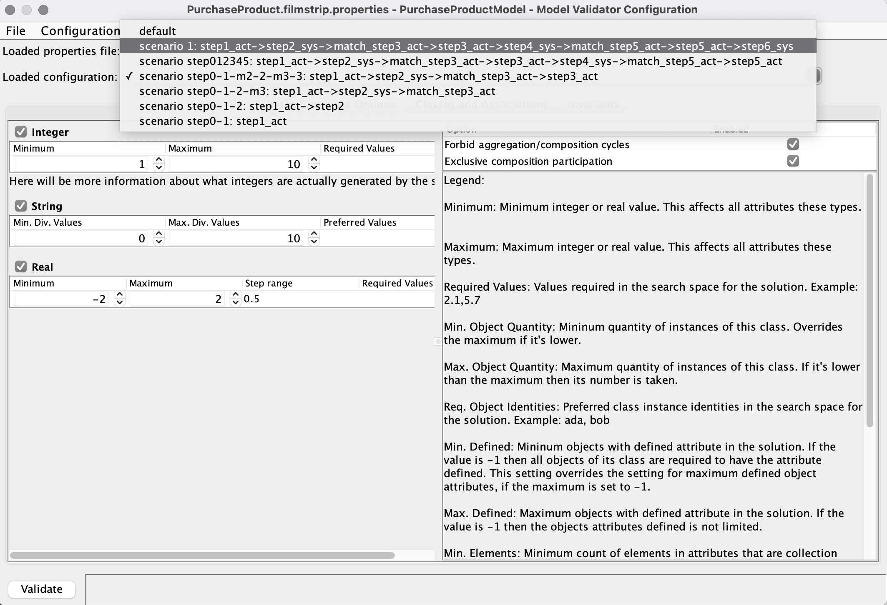
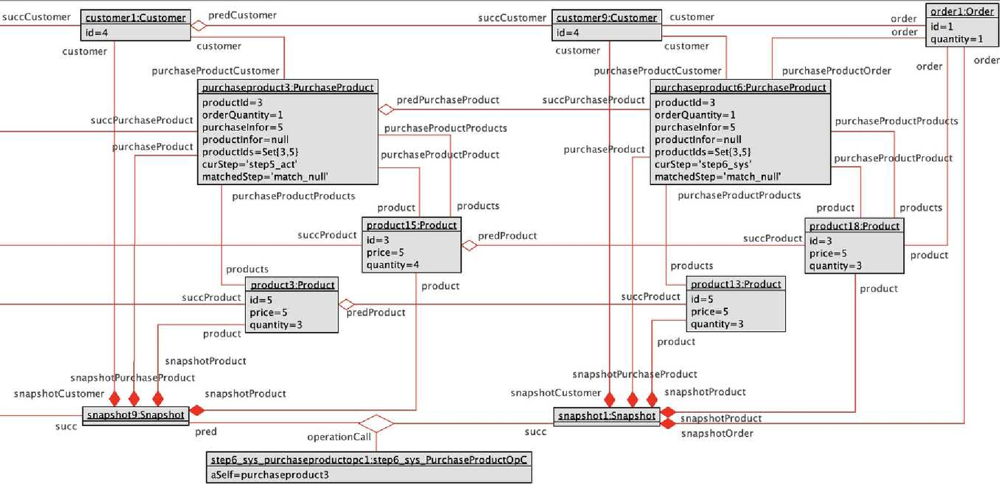

# PurchaseProduct example evaluation guide

## Prerequisites

This guide assumes you have already read the [README](../../../README.md) and have the necessary tools installed.

You can use the provided files in this folder to evaluate this example.

## Evaluation

### Step 1. Defining an application model for use cases (Eclipse/FRSL)

- Import the `frsl` and `frsl2filmstrip` projects into Eclipse.
- Run the runtime environment: *Right click to any project -> Run As -> Eclipse Application*.
- In the runtime environment, load the example projects (examples/org.eclipse.sme.frsl2filmstrip.examples/).
- Generate the *.frslas* file from the *.frsl* file:
  - Open the `purchaseProduct.frsl` file -> Right click on white space in file -> FRSLCS -> Save As -> FRSLAS.

- Generate the Filmstrip model (the two files: *.use* and *.properties*) from the *.frslas* file:
  - Open the `purchaseProduct.frslas` file -> Right click on file icon -> Frslas2Filmstrip -> Generate Filmstrip Model.

- After the generation, you will see the two files in the `filmstrip-gen` folder (which are equivalent to the files in the `USE_purchaseProduct` folder).

### Step 2. Generating the filmstrip model (USE/Filmstrip)

- Run the tool USE:
  - Navigate to `<USE_folder>/use-assembly/target/use-7.1.1/bin`.
  - On Windows: run the `use.bat` file.
  - On Linux: open terminal and run the command `./use`.
- First, we have to load the source model. In this example, the source model is specified in `PurchaseProduct.use` that we just generated:

  - Select `Open specification` button under `File` menu or you can use `Open specification` button right in the toolbar.

  - Choose `PurchaseProduct.use`.

A successful model load should look like this:

- Invoke the filmstrip plugin by selecting the menu item `Plugins -> Filmstrip`.

- Save the .use file for Filmstrip model:

  - Hit `Select` to specify a save file.

  - You do not have to select a file, just write the file name that you want. In this case, we will name it `PurchaseProductFilmstrip.use` and hit `Save`.

  - Hit `Ok` to start the transformation process.

  - If the transformation is successful, it should show a window like this:

### Step 3. Generating Test Cases by Model Finding (USE/Model Validator)

# KSE_2024_Draft

Generating Test Cases by Model Finding (USE/Model Validator

As you successfully go through Step 2, you will obtain a filmstrip model file `PurchaseProductFilmstrip.use`. 

- Open the `PurchaseProductFilmstrip.use` file. It will be loaded as in the below image.

- Select `Configuration` under `Plugin > Model Validator`.

- A Configuration window should appear like this:

- Load the properties file (the `.properties` file) automatically generated along with the filmstrip model in Step 1 by selecting `File > Open`, then navigate to where the properties file is.

- Choose a scenario (which corresponds to a search configuration) you want to generate test case for.  Once the configuration is loaded, you can update the configuration or add other constraints as needed before generating test data for the chosen scenario.

- Hit the `Validate` button at the bottom-left corner of the configuration window to let the USE Model Validator find an approriate test case. This process may take some time. After that, the result will be shown in the Log window at the bottom of the USE window. 
  - In our example, the result is `SATISFIABLE`, which means that the Model Validator is able to find a test case for the chosen scenario. On the other hand, if the plugin failed to find a test case for the chosen scenario, the result `UNSATISFIABLE` will be shown in the Log.

- You can then select `View > Object diagram` to have a view of the object model corresponding to the test case the USE Model Validator generate. Below is a part of the test case generated in our example.

